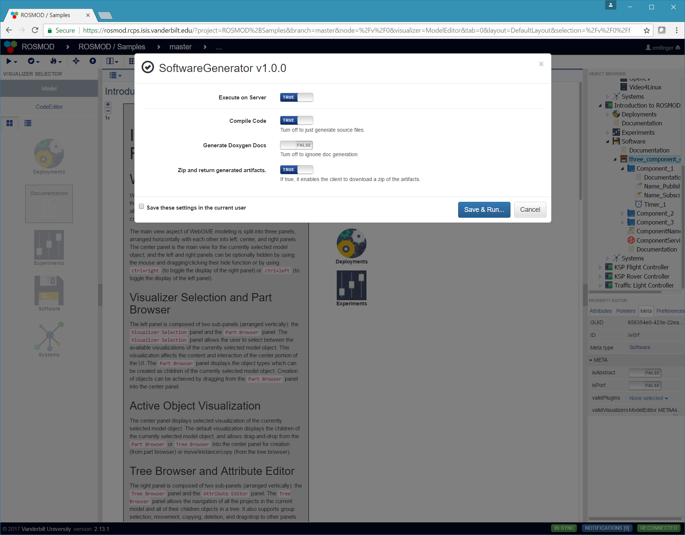
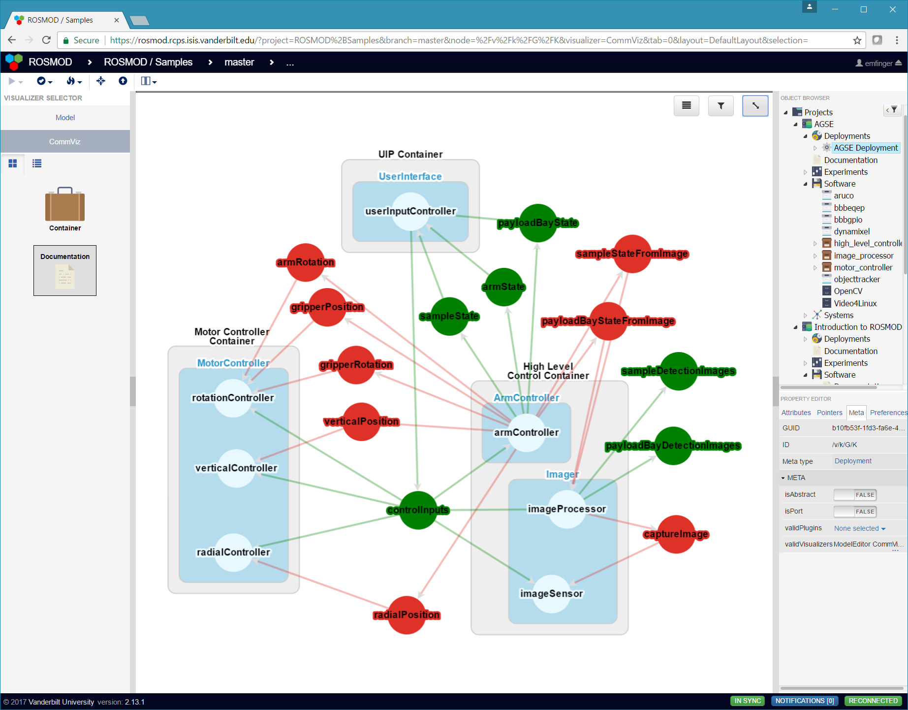
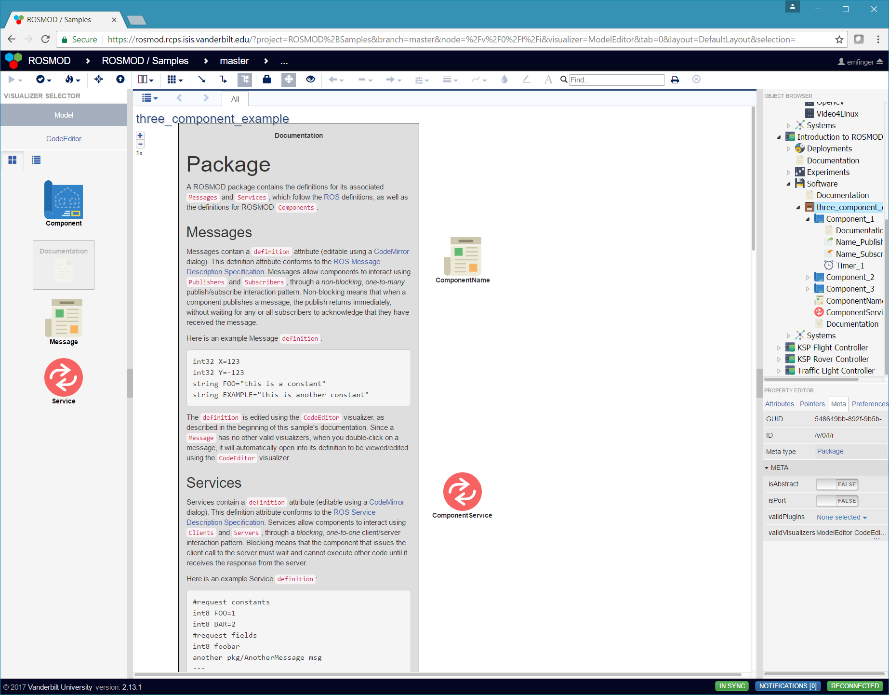

# ROSMOD

This repository contains the implementation of
[ROSMOD - Journal of Electronics](http://www.mdpi.com/2079-9292/5/3/53),
built on [WebGME](http://github.com/webgme/webgme).

ROSMOD is a web-based, collaborative, modeling and execution
environment for distributed embedded applications built using
[ROS](http://www.ros.org).

An example server running ROSMOD can be found on
[rosmod.rcps.isis.vanderbilt.edu](http://rosmod.rcps.isis.vanderbilt.edu).

## Contents

1. [What is ROSMOD](#what-is-rosmod)
    1. [Motivation](#motivation)
	2. [Implementation](#implementation)
	3. [Features](#features)
2. [How to set up ROSMOD](#how-to-set-up-rosmod)
    1. [Setting up the ROSMOD server](#setting-up-the-rosmod-server)
	2. [Setting up target systems to run ROSMOD](#setting-up-target-systems-to-run-rosmod)
3. [How to use ROSMOD](#how-to-use-rosmod)
    1. [Creating a ROSMOD project](#creating-a-rosmod-project)
	2. [Modeling the Software](#modeling-the-software)
	3. [Modeling the Systems](#modeling-the-systems)
	4. [Creating a Deployment](#creating-a-deployment)
	5. [Running an Experiment](#running-an-experiment)
4. [Keeping ROSMOD up to date](#keeping-rosmod-up-to-date)


## What is ROSMOD?

The Robot Operating System Model-driven development tool suite,
(ROSMOD) an integrated development environment for rapid prototyping
component-based software for the Robot Operating System (ROS)
middleware.

ROSMOD consists of 
1. The *ROSMOD Server*, which provides collaborative model-driven
   development, and
2. The *ROSMOD Comm* layer, which extends ROS to provide a more well
   defined component execution model with support for prioritization
   of component event triggers.

### Motivation

Robotics is a discipline that involves integration between
heterogeneous fields such as electronics, mechanics, computer science,
control theory and artificial intelligence. During the design,
development and deployment of robotic systems, the components that
belong to the various sub-systems, e.g., image processing software,
servo-motors, power distribution system, etc., must work congruously
to achieve a common goal. As systems increase in complexity, software
development platforms must enable the creation of such components in a
rapid, reliable, and reusable manner while also providing
systems-level design, analysis, and deployment.

In other similar systems, users are often tasked with developing the
models, generating the code, and then manually touching the generated
code to implement the business logic for the various operations their
system needs to perform (e.g. periodic or event-triggered
functions). The injection and management of this user-developed code
inside the generated code can increase the learning curve for new
users as it adds some extra file management and build-system
overhead. Additionally, almost all other similar projects require
installation on the users' computers, which means they may need to
troubleshoot setting up the IDE, the compiler, and any other required
libraries (e.g. catkin, python, ssh, etc.) which will increase the
time it takes to configure their system and increase the number of
failure points in their configuration process (not to mention
increasing the platform and version control support nightmare).

To combat these issues, we wanted ROSMOD to act as a lightweight (from
the users' perspectives) IDE which does not require *any*
installation, and can be run cross-platform since it only relies on a
web-browser (even smartPhones can act as interfaces!). In this way,
the development of robotics with ROSMOD is done in a
**decentralized**, **collaborative**, **automatically versioned
development** , with **centralized management** of the infrastructure
(including any compatibility, package version management, and build /
deployment infrastructure management).

### Implementation

ROSMOD is implemented as a web-based graphical interface to a
versioned, git-like database of models with integrated code. Along
with this database exist server-side plugins which enable the
generation, compilation, and deployment of executable code. This
executable code is fully complete without the need for users to touch
or even download the files. These plugins have accses to the
file-system on the server, where the sys-admin for the ROSMOD
webserver has already configured the build system and deployment
infrastructure so that these plugins can automatically perform the
compilation and deployment as requested by the users.

### Features

* Collaborative, automatically versioned web-based development

	

* Model-based framework for developing hardware and software

	

* Fully integrated code development, with documentation generation

	

* Fully integrated code generation, compilation, and deployment

	

* Interactive deployment visualization

	

* Embeddable documentation at every level of the model

	

* Distributed debugging enabled by automatic trace logging and
  plotting of trace and user logs

	

* Automatic load management of embedded targets

	I don't have a picture here because it's in the backend :)

## How to set up ROSMOD

### Setting up the ROSMOD Server

1. Install [NVM](https://github.com/creationix/nvm)
   ```bash
   wget -qO- https://raw.githubusercontent.com/creationix/nvm/v0.33.1/install.sh | bash
   ```
2. Install [NodeJS LTS](http://nodejs.org)
   ```bash
   nvm install --lts nodejs
   ```
3. Install Bower
   ```bash
   npm install -g bower
   ```
4. Install [MongoDB](http://mongodb.com)
   ```bash
   sudo apt-get install mongodb
   ```
5. Clone this repo
   ```bash
   git clone https://github.com/rosmod/webgme-rosmod
   ```
6. Install dependencies
   ```bash
   cd webgme-rosmod
   npm update
   ```
7. Start the server
   ```bash
   npm start
   ```
   
*NOTE:* to make changes to the `META` or to view the `META`, you can run 

``` bash
npm run start-dev
```

which enables the `META` visualizer.

### Setting up target systems to run ROSMOD

1. Install [ROS](http://www.ros.org) onto the target platform.
   
   *NOTE:* only *ros-\<version\>-ros-base* is required, but any install
    target works.
   
2. Install [ROSMOD-COMM](http://github.com/rosmod/rosmod-comm) onto
   the target platform.
3. Ensure the target has *SSH capabilities*; configure an ssh key that
   the ROSMOD server can use to remotely access the target device.
   
   *NOTE:* password-based authentication is not allowed for ROSMOD
    targets.

## How to use ROSMOD

This section serves as a short guide for users who want to develop
robotics with ROSMOD. A more complete guide into what each of the
elements of a ROSMOD model is can be found in the
[Samples Seed](./src/seeds/samples.webgmex), which contains some
example projects for robots, autonomous cars, and automous planes, as
well as a simple `Introduction to ROSMOD` sample which is fully
documented (within the model using `Documentation` objects that render
[Markdown](https://en.wikipedia.org/wiki/Markdown) within the
model. This sample is hosted on the live server listed at the top of
this page, but can also be used as the base for any project created in
any deployment of the server since it is part of this repository.

### Creating a ROSMOD Project

### Modeling the Software

### Modeling the Systems

### Creating a Deployment

### Running an Experiment

## Keeping ROSMOD Up-to-Date
